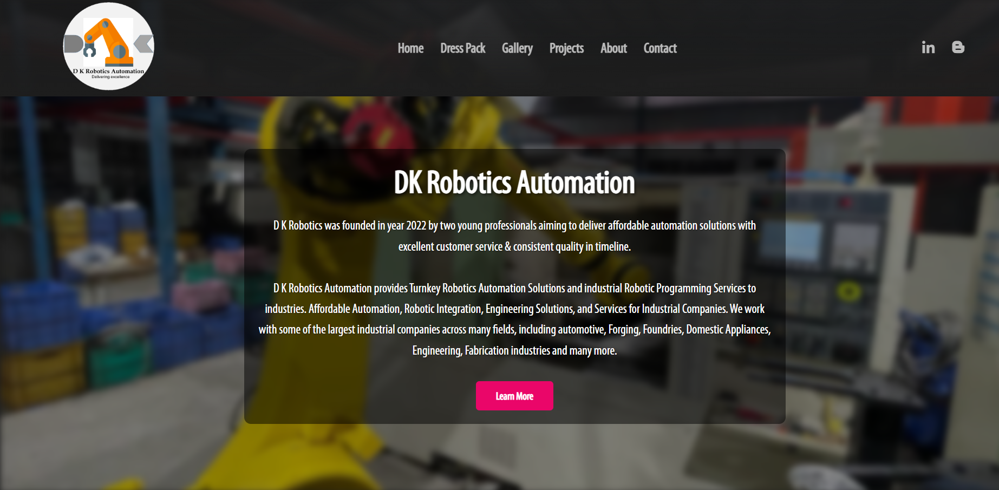

<h1>  DK Robotics Company Website</h1>

  
  
  
  
  

  

---

## 📖 Project Overview  

The **DK Robotics Company Website** is a **modern, static web project** developed during an internship at DK Robotics.  
It serves as the company’s **official online presence**, providing information about projects, gallery, products, and contact details.  

Built with **HTML, CSS, and JavaScript**, the site is designed for **clean UI, responsive design, and user-friendly navigation**.  

---

### 🏠 Homepage  

  

  

## ✨ Features  

✅ **Responsive Design** – Works across desktop, tablet, and mobile  
✅ **Structured Pages** – Multiple sections for company details and portfolio  
✅ **Error Handling** – Custom 404 and error pages  
✅ **Firebase Hosting** – Deployed with Firebase for fast and secure access  

### 📂 Pages Included  
- `index.html` → Homepage  
- `about us.html` → Company details  
- `projects.html` → Showcase of robotic solutions  
- `gallery.html` → Image portfolio  
- `contact us.html` → Inquiry form  
- `dresspack.html` → Product/marketing showcase  
- `404.html`, `error.html` → Error pages  
- `terms.html`, `privacypolicy.html` → Legal documentation  

### 📁 Asset Organization  
- `fonts/` → Custom typography  
- `styles/` → CSS files (`app.css`, `grid.css`)  
- `gallery/`, `pictures/` → Image assets  
- `app.js`, `srcp.js` → JavaScript logic  
- `.firebaserc`, `firebase.json` → Firebase hosting configuration  

---

## 🛠 Tech Stack & Tools  

  
  
  
  

---

## 🚀 Future Enhancements  

- 🎨 Add animations & transitions for better UX  
- 📧 Backend/email integration for **contact form**  
- 🔍 SEO optimization with **meta tags & sitemap**  
- ⚡ Optimize **CSS & JS performance**  
- 🔄 Continuous Deployment (**GitHub → Firebase**)  

---
